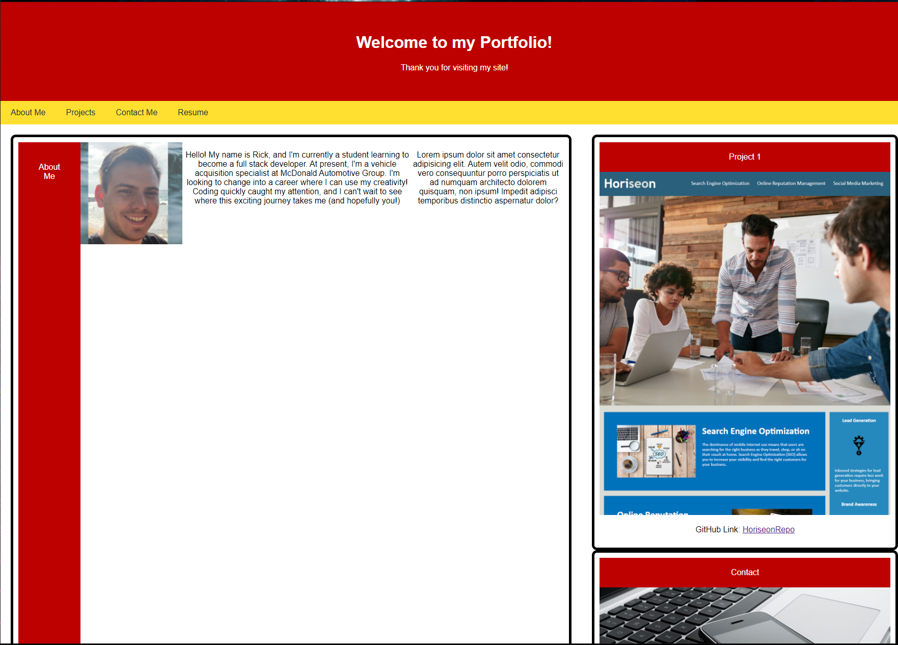

# Rick Ansay's Full Stack Web Portfolio

Welcome to my portfolio! I am constantly updating this and adding to my projects. Thanks for taking the time to look at my page!

## Lessons Learned

  
## Screenshots

Here is a screenshot of my webpage on desktop:

  
## Demo

https://rickyricer.github.io/RickAnsayFullStackPortfolio/

  
## Feedback

If you have any feedback, please reach out to me at Rick.Ansay@gmail.com 

  
## 🔗 Links

  
## Acknowledgements

